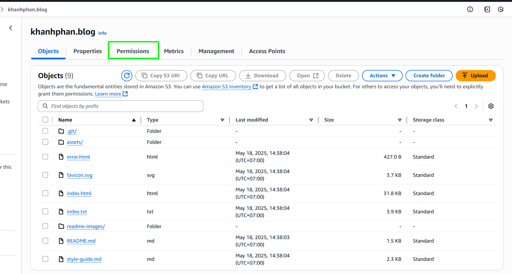
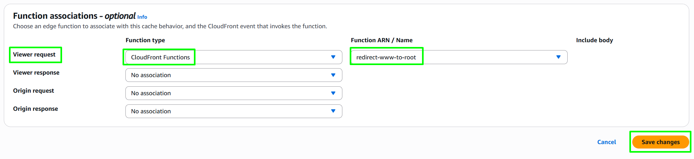

# aw-s3-static-website-using-cloudfront-route53

## 💼 Case Study 

**Đề bài:** Đưa website cá nhân lên internet với domain riêng, HTTPS và tốc độ toàn cầu

Bạn vừa hoàn thành một website portfolio cá nhân gồm các file tĩnh (HTML, CSS, JS, ảnh dự án). Bây giờ, bạn muốn triển khai website ra internet thật sự với các yêu cầu rõ ràng như sau:

**Yêu cầu của bài toán**

- Website cần truy cập nhanh toàn cầu, kể cả từ châu Á, châu Âu hay Mỹ

- Phải có domain thật, ví dụ: https://khanhphan.blog

- Tự động redirect từ www.khanhphan.blog về domain chính

- Website được bảo vệ bằng SSL hợp lệ, không có cảnh báo bảo mật trình duyệt

- Nội dung phải được cache lại ở các edge location, tránh gọi lại về server gốc S3

- Tuyệt đối không để S3 bucket public, chỉ CloudFront được phép truy cập

- Giải pháp cần ổn định, bảo mật, chi phí thấp và đúng chuẩn production

## 🧪 Kiến trúc đề xuất

> Đây là kiến trúc được sử dụng rộng rãi để deploy blog cá nhân, landing page, trang giới thiệu, sản phẩm cá nhân... theo tiêu chuẩn cloud-native


| Service                           | Vai trò                                                               |
| --------------------------------- | --------------------------------------------------------------------- |
| **Amazon S3**                     | Lưu trữ nội dung website tĩnh (HTML, CSS, JS, ảnh...)                 |
| **CloudFront**                    | CDN phân phối nội dung nhanh, bật HTTPS, cache nội dung               |
| **Origin Access Control (OAC)**   | Giúp CloudFront truy cập S3 mà không cần public bucket                |
| **AWS Certificate Manager (ACM)** | Cung cấp chứng chỉ SSL miễn phí cho domain                            |
| **Amazon Route 53**               | Quản lý DNS, trỏ domain `khanhphan.blog` về CloudFront                |
| **CloudFront Function**           | Xử lý redirect từ `www.khanhphan.blog` về `khanhphan.blog` (HTTP 301) |

Trong bài lab này mình sẽ chia làm các phần nhỏ hơn:

1. Tạo và xác thực chứng chỉ SSL với AWS Certificate Manager cho domain

2. Cấu hình CloudFront để phân phối website, tích hợp SSL và kết nối với S3

Trong loạt bài này mình sẽ sử dụng cả AWS web console, AWS CLI và Terraform. Thật ra mình chỉ tính làm CLI thôi nhưng nghĩ lại cần thực hành trước với giao diện để hiểu rõ hơn cấu hình thì mới apply tốt CLI được, bài có thể sẽ hơi dài, mong mọi người thông cảm.

## 🧱 Yêu cầu

- Đã mua domain trước đó (domain của mình là `khanhphan.blog`).
- Đã upload static website lên bucket S3 có tên trùng với tên domain. Mọi người có thể tham khảo bài viết trước nếu chưa upload static website [Triển khai Static Website lên S3 Bucket](https://ptmkhanh29.github.io/tutorial-aws-labs/posts/trien-khai-static-website-tren-s3-bucket/)
- Cách làm: hoặc Web console, hoặc AWS CLI hoặc Terraform. Vì điều kiện bài viết nên mình sẽ hướng dẫn bằng Web console trước để mọi người hiểu về config, sau đó là AWS CLI. Cuối bài sẽ có script Terraform để apply các step trên. Mọi người lưu ý chỉ làm 1 trong 3 cách thôi nhé.

---

# Phần 1 - Tạo và xác thực chứng chỉ SSL với AWS Certificate Manager cho domain

## 🛠️ Các bước thực hiện

### 1. Chuyển Nameserver từ Domain provider sang Route 53

>Để xác minh quyền sở hữu domain và cấp chứng chỉ SSL với AWS Certificate Manager (ACM), bạn cần có quyền quản lý hệ thống DNS của domain. Điều này yêu cầu trỏ domain đang quản lý ở Domain provider - nơi bạn mua domain về Route 53 của AWS – nơi bạn sẽ tạo bản ghi CNAME xác minh ACM.
>
>Nếu không trỏ nameserver về Route 53, chúng ta sẽ không thể tạo bản ghi DNS cần thiết, và quá trình cấp SSL sẽ thất bại.
{: .prompt-info }

#### 1.1 Tạo Hosted Zone cho domain ở Route 53

Truy cập AWS Console > Route 53. Ở thanh sidbar bên trái chọn `Hosted Zones`


Click `Create Hosted Zone` để tạo Hosted Zone cho domain


Bạn cấu hình cho `Hosted Zone` của mình như sau:

+ Domain name: là tên domain của bạn, ví dụ ở đây là `khanhphan.blog`

+ Type: Public hosted zone

Sau đó click `Create Hosted Zone`


Tới đây `Hosted Zone` của mình đã được tạo thành công. Bạn expand section `Hosted zone details` ra để lưu lại 2 phần quan trọng

- `Id`: ID của Hosted Zone (mình sẽ dùng để tạo bản ghi DNS), nó có dạng `/hostedzone/<Hosted zone ID>`

`/hostedzone/Z08218493EOPVIZVEXDYE`

- `NameServers`: 4 dòng NameServers cần dùng để trỏ về Hostinger

```
ns-183.awsdns-22.com
ns-1816.awsdns-35.co.uk
ns-1515.awsdns-61.org
ns-671.awsdns-19.net
```

>**Lưu ý:** do mình demo tạo với 2 cách là Web Console và CLI nên 2 giá trị của `Hosted Zone ID` và `Nameservers` của 2 cách tạo khác nhau. Bạn dùng 1 trong 2 cách là được.
{: .prompt-danger }

#### 1.2 Chỉnh sửa Nameservers trong Domain Provider

Domain Provider của mình là Hostinger. Mình đăng nhập rồi truy cập mục `Domains`, chọn domain name `khanhphan.blog`


Chọn mục DNS / Nameservers từ sidebar bên trái


Trong Nameservers hiện tại của mình có 2 Nameserver mặc định là 

```
ns1.dns-parking.com
ns2.dns-parking.com
```

Nhấn `Change Nameservers`, mình sửa 2 NS mặc định này thành 4 NS mà Route 53 đã cung cấp ban nãy (mình lấy trong cách làm với CLI), sau đó nhấn Save để lưu lại


Sau khi apply thay đổi, chúng ta sẽ cần chờ 5–60 phút để DNS cập nhật toàn cầu. Sau đó test lại như sau

```bash
nslookup -type=ns <domain_name>
#Ex: nslookup -type=ns khanhphan.blog
```


Vậy là mình đã hoàn tất việc thay đổi Nameserver thì NS mặc định của Domain Provider sang NS của Route 53. Ở phần tiếp theo chúng ta sẽ tiến hành xác minh domain qua DNS để cấp chứng chỉ SSL thông qua ACM để AWS xác thực domain này là của mình và cho phép domain sử dụng các service.

### 2. Xác minh domain qua DNS để cấp chứng chỉ SSL với ACM

#### 2.1. Gửi yêu cầu tạo chứng chỉ SSL bằng ACM và lấy bản ghi DNS

> **Mục đích:** Để bật HTTPS cho website khi truy cập qua CloudFront.
> 
> Chứng chỉ SSL giúp trình duyệt hiển thị biểu tượng 🔒 bảo mật, mã hóa kết nối giữa người dùng và website (CloudFront), tăng độ tin cậy và bảo vệ dữ liệu khỏi bị nghe lén.
{: .prompt-info }

> **Lưu ý:** phải tạo ở region `us-east-1` bởi vì CloudFront chỉ hỗ trợ sử dụng chứng chỉ SSL từ ACM ở region này.
{: .prompt-danger }

Truy cập AWS Console > Certificate Manager. Ở cột Sidebar bên trái click vào `List certificates`. Click `Request`


- Certificate type: `Request a public certificate` → Là SSL công khai, chọn tùy chọn này để dùng cho CloudFront/S3. Sau đó click `Next` để tiếp tục


- Domain names: Nhập tên miền chính mà bạn sở hữu, của mình là `khanhphan.blog`. Do mình muốn redirect từ `www.khanhphan.blog` về `khanhphan.blog`, nên mình sẽ thêm cả `www.khanhphan.blog` vào đây luôn

- Validation method: DNS validation

- Key Algorithm: RSA 2048


Sau đó click `Request`.

Khi vừa tạo xong chứng chỉ SSL, bạn sẽ thấy trạng thái của 2 domain là `Pending validation`, tức là dù SSL đã được tạo nhưng nó vẫn chưa được Validate, vì ACM đang chờ bạn xác minh quyền sở hữu domain bằng cách tạo bản ghi CNAME trong DNS (Route 53), lúc này trạng thái sẽ tự động chuyển sang `Success` và sau đó là `Issued`.

Chúng ta sẽ cần lưu lại 3 giá trị của Name, Type, Value của 2 domain để tạo bản ghi CNAME tương ứng trong Route 53.


#### 2.2. Tạo bản ghi CNAME trong Route 53 để xác thực chứng chỉ SSL

> Đây là bước cực kỳ quan trọng để xác thực yêu cầu chứng chỉ SSL đã gửi đến ACM ở bước trước đó.
> 
> Việc tạo bản ghi CNAME giúp chứng minh rằng bạn thật sự sở hữu domain, từ đó ACM mới **THỰC SỰ** cấp chứng chỉ SSL và cho phép CloudFront bật HTTPS.
{: .prompt-danger }

Vào AWS Console > Route 53 > Chọn Hosted Zone đã tạo ở bước 1 > Click `Create Record`


Vì mình đang tạo chứng chỉ SSL cho 2 domain nên sẽ cần tạo 2 bản ghi CNAME trong Route 53 để xác minh mỗi domain một bản ghi.

✅ Cách điền Record

📌 Đối với domain `khanhphan.blog`

+ CNAME name (từ ACM): `_ebbc3b0b8cad57d6bf8e99514f0c29be.khanhphan.blog.`

+ CNAME value (từ ACM): `_9630ae438864949041ef512326f8945d.xlfgrmvvlj.acm-validations.aws.`

>Khi tạo record trong Route 53:
>+ Record name: _ebbc3b0b8cad57d6bf8e99514f0c29be (bỏ đuôi `.khanhphan.blog.` vì Route 53 sẽ tự thêm vào)
>+ Value: _9630ae438864949041ef512326f8945d.xlfgrmvvlj.acm-validations.aws.
>+ Record type: CNAME
{: .prompt-danger }

Nhấn `Create records`


📌 Đối với domain `www.khanhphan.blog`

>Khi tạo record trong Route 53:
>+ Record name: _aed77fe6dc7721423af629eeec710728.www (bỏ đuôi `.khanhphan.blog.` vì Route 53 tự thêm domain gốc)
>+ Value: _49100fd55647c5add4af92bffc26daf5.xlfgrmvvlj.acm-validations.aws.
>+ Record type: CNAME
{: .prompt-danger }

Ok, hai bản ghi CNAME cho 2 domain tương ứng đã được tạo thành công


Bạn chờ vài phút rồi load lại chứng chỉ SSL sẽ thấy Status của 2 domain chuyển từ `Pending validation` sang `Success` nghĩa là đã xác minh chứng chỉ SSL thành công.

Sau khi bạn đã tạo đúng các bản ghi CNAME trong Route 53, Status của chứng chỉ SSL ở ACM có thể vẫn hiển thị là `Pending validation`. Đừng lo, hệ thống cần một khoảng thời gian để xác minh DNS – thường từ vài phút đến khoảng 30 phút. Bạn chỉ cần chờ một lúc rồi tải lại trang. Khi trạng thái chuyển sang `Success` như ảnh, tức là chứng chỉ đã được xác minh thành công và sẵn sàng để sử dụng.


**Sử dụng AWS CLI**

```bash
aws route53 change-resource-record-sets \
  --hosted-zone-id <your-hosted-zone-id> \
  --change-batch '{
    "Comment": "ACM domain validation for SSL",
    "Changes": [{
      "Action": "UPSERT",
      "ResourceRecordSet": {
        "Name": "<thay_bang_name_trong_ResourceRecord>",
        "Type": "CNAME",
        "TTL": 300,
        "ResourceRecords": [{
          "Value": "<thay_bang_value_trong_ResourceRecord>"
        }]
      }
    }]
  }'
```

Kết quả trả về


**⏳ Chờ xác minh chứng chỉ**

**Sử dụng AWS Console**

**Sử dụng AWS CLI**

`"Status": "PENDING"` nghĩa là Route 53 chưa hoàn tất việc áp dụng bản ghi DNS, không phải lỗi. Chúng ta sẽ đợi vài phút rồi chạy lệnh `describe-certificate` để theo dõi tiến trình xác minh SSL

Kiểm tra trạng thái của chứng chỉ SSL

```bash
aws acm describe-certificate \
  --certificate-arn <CertificateArn> \
  --region us-east-1 \
  --query "Certificate.Status"
```

Hoặc nếu bạn dùng AWS Console bạn quay lại trang chứng chỉ trong ACM, status của SSL sẽ chuyển từ `Pending validation` sang `Issued`, tức là đã xác minh thành công, chứng chỉ SSL đã được cấp.


## ⚙️ Thực hành với AWS CLI

### 1. Tạo Hosted Zone cho domain ở Route 53:

> Tài liệu tham khảo: [AWS CLI create Hosted Zone](https://docs.aws.amazon.com/cli/latest/reference/route53/create-hosted-zone.html) 

```bash
# Tạo hosted zone với tên trùng với tên domain của bạn
aws route53 create-hosted-zone \
  --name khanhphan.blog \
  --caller-reference "$(date +%s)" \
  --hosted-zone-config Comment="Hosted zone for khanhphan.blog",PrivateZone=false
```

Kết quả mình nhận được 1 block json chứa 2 thông tin quan trọng mà mình cần sử dụng

- `Id`: ID của Hosted Zone (mình sẽ dùng để tạo bản ghi DNS)

`/hostedzone/Z01355962M1J001DOC1Q0`

- `NameServers`: 4 dòng NameServers cần dùng để trỏ về Hostinger

```json
"NameServers": [
    "ns-826.awsdns-39.net",
    "ns-1114.awsdns-11.org",
    "ns-261.awsdns-32.com",
    "ns-1646.awsdns-13.co.uk"
]
```


### 2. Chỉnh sửa Nameservers trong Domain Provider

Tham khảo bước trước [Chỉnh sửa Nameservers trong Domain Provider](#12-chỉnh-sửa-nameservers-trong-domain-provider)

### 3. Gửi yêu cầu tạo chứng chỉ SSL bằng ACM và lấy bản ghi DNS

```bash
#! Lưu ý: option --subject-alternative-names là thêm tên miền phụ
aws acm request-certificate \
  --domain-name khanhphan.blog \
  --subject-alternative-names www.khanhphan.blog \
  --validation-method DNS \
  --region us-east-1
```

📌 Lưu lại `CertificateArn` để sử dụng cho bước 2

```yaml
{
  "CertificateArn": "arn:aws:acm:us-east-1:898508216915:certificate/69b4313f-df53-4a77-a2dc-5ce8a6c3718c"
}
```

Sau khi đó có `CertificateArn` chúng ta tiến hành lấy bản ghi DNS

```bash
#! <CertificateArn> điền CertificateArn đã lưu ở bước 1 vào đây
aws acm describe-certificate \
  --certificate-arn "arn:aws:acm:us-east-1:898508216915:certificate/69b4313f-df53-4a77-a2dc-5ce8a6c3718c" \
  --region us-east-1
```

Sau khi chạy lệnh `aws acm describe-certificate`, bạn sẽ thấy trong phần `DomainValidationOptions` xuất hiện thông tin của từng bản ghi CNAME mà AWS yêu cầu bạn tạo để xác minh quyền sở hữu domain. Mỗi domain hoặc subdomain (ví dụ: `khanhphan.blog` và `www.khanhphan.blog`) sẽ có một cặp Name và Value dùng để tạo bản ghi CNAME trong Route 53. Bạn cần sao chép chính xác các giá trị này (gồm cả dấu chấm ở cuối) để tạo bản ghi CNAME trong Route 53.


**❓ Status `PENDING_VALIDATION` là sao?**

>Trạng thái "PENDING_VALIDATION" có nghĩa là AWS ACM vẫn đang chờ xác minh rằng bạn đã thực sự tạo bản ghi CNAME tương ứng trong DNS. Đây là bước kiểm tra xem bạn có thật sự sở hữu domain này hay hơn. Ok sang bước tiếp theo chúng ta sẽ tìm cách để làm sao cho AWS hiểu domain này thật sự là của chúng ta.

### 4. Tạo bản ghi CNAME trong Route 53 để xác thực chứng chỉ SSL

- Lấy `HostedZoneId` của domain

```bash
aws route53 list-hosted-zones-by-name \
  --dns-name khanhphan.blog \
  --query "HostedZones[0].Id" \
  --output text
```

Kết quả: 

```yaml
/hostedzone/Z01355962M1J001DOC1Q0
```

- Tạo file `create-cname-lab-06.json` để batch tạo 2 bản ghi DNS, bạn cần thay giá trị cho `Name` và `Value` từ output đã chạy của lệnh `describe-certificate` trước đó), ví dụ của mình:

```json
{
  "Comment": "Add CNAME records for SSL validation",
  "Changes": [
    {
      "Action": "UPSERT",
      "ResourceRecordSet": {
        "Name": "_ebbc3b0b8cad57d6bf8e99514f0c29be.khanhphan.blog.",
        "Type": "CNAME",
        "TTL": 300,
        "ResourceRecords": [
          {
            "Value": "_9630ae438864949041ef512326f8945d.xlfgrmvvlj.acm-validations.aws."
          }
        ]
      }
    },
    {
      "Action": "UPSERT",
      "ResourceRecordSet": {
        "Name": "_aed77fe6dc7721423af629eeec710728.www.khanhphan.blog.",
        "Type": "CNAME",
        "TTL": 300,
        "ResourceRecords": [
          {
            "Value": "_49100fd55647c5add4af92bffc26daf5.xlfgrmvvlj.acm-validations.aws."
          }
        ]
      }
    }
  ]
}
```

- Gửi lệnh tạo bản ghi:

```bash
aws route53 change-resource-record-sets \
  --hosted-zone-id Z01355962M1J001DOC1Q0 \
  --change-batch file://create-cname-lab-06.json
```


Khi bạn đã tạo đúng bản ghi CNAME và DNS được đồng bộ, trạng thái `PENDING VALIDATION` sẽ tự động chuyển thành `SUCCESS` – tức là chứng chỉ SSL đã được xác minh thành công và sẵn sàng sử dụng.

Bạn cần chờ một chút, sau đó chạy lại lệnh kiểm tra để xác nhận:

```bash
aws acm describe-certificate
  --certificate-arn arn:aws:acm:us-east-1:898508216915:certificate/69b4313f-df53-4a77-a2dc-5ce8a6c3718c \
  --region us-east-1 \
  --query "Certificate.DomainValidationOptions[*].{Domain:DomainName, Status:ValidationStatus}" \
  --output table
```


# Phần 2 - Cấu hình CloudFront để phân phối website, tích hợp SSL và kết nối với S3

## 🎯 Mục tiêu

- Tạo CloudFront Distribution để phân phối nội dung từ S3 website

- Gắn chứng chỉ SSL đã xác minh từ trước [Triển khai Static Website với AWS S3, CloudFront, Route 53, SSL và Redirect - Phần 1](https://ptmkhanh29.github.io/tutorial-aws-labs/posts/trien-khai-static-website-tren-aws-s3-voi-cloudfont-route-53-acm-redirect-p1/)

- Cấu hình bảo mật cho S3 bằng **Origin Access Control (OAC)**

- Trỏ domain về CloudFront qua Route 53

- Giải thích chi tiết từng cấu hình để bạn hiểu rõ cách CloudFront hoạt động

## 🛠️ Các bước thực hiện

### 1. Tạo CloudFront Distribution

**Sử dụng AWS Console**

Vào AWS Console, truy cập `CloudFront`. Chọn **Create a CloudFront distribution**


---

#### Cấu hình Origin

**1. Origin domain**

Với static website dùng S3, bạn nên chọn bucket kiểu REST endpoint, ví dụ mình chọn bucket của mình:
`khanhphan.blog.s3.amazonaws.com`

**KHÔNG** chọn endpoint dạng `.s3-website-`... vì nó không hỗ trợ HTTPS


**2. Origin access**

Chọn **"Origin access control settings (recommended)"**, mục đích chỉ cho phép CloudFront đọc dữ liệu của S3 thông qua OAC

>Bạn có thể hiểu đơn giản như sau: 
>- Nếu không dùng OAC, thì bạn sẽ phải mở bucket S3 để public access, tức là ai biết link file cũng có thể tải về → ⚠️ Nguy hiểm
>- Nếu dùng OAC, thì:
>    - Bucket của bạn private hoàn toàn
>    - Chỉ CloudFront mới có quyền đọc dữ liệu từ S3 (qua chữ ký bảo mật SigV4)
>    - Bạn vẫn phân phối nội dung toàn cầu mà không lo có ai đó truy cập bucket của mình
{: .prompt-tip }

**3. Origin access control**

Nếu bạn chưa có OAC nào có thể click **Create new OAC** để tạo một OAC mới:
  - **Name**: Đặt tên cho OAC, ví dụ mình đặt `oac-lab-07`
  - **Signing behavior**: Chọn `Sign requests (recommended)`
  - Ở đây, mình bỏ qua tùy chọn `Do not override authorization header` (vì mình dùng cho static website, không cần xử lý auth đặc biệt)

Click `Create`

{: width="972" height="589" }

⚠️ Sau khi chọn OAC, chúng ta sẽ thấy cảnh báo “You must update the S3 bucket policy”. Bạn **có thể cập nhật policy sau khi tạo CloudFront xong**, AWS sẽ cung cấp đoạn JSON sẵn cho bạn dán vào bucket.


---

#### Cấu hình Default cache behavior (hành vi phân phối)

- **Compress objects automatically**: Chọn `Yes` để tự động nén file tĩnh (HTML, CSS, JS...) trước khi gửi đến trình duyệt, tăng tốc độ tải trang.

- **Viewer protocol policy**: `Redirect HTTP to HTTPS`  
  Giúp người dùng luôn truy cập HTTPS, tăng bảo mật

- **Allowed HTTP methods**: `GET, HEAD` (Static web chỉ cần 2 method này)

- **Restrict viewer access**: chọn `No`


- **Cache key and origin requests**: chọn `Cache policy and origin request policy (recommended)`, trong phần Cache policy chọn `CachingOptimized`


#### Cấu hình Function associations

- **Function associations** là nơi cho phép bạn gắn thêm các hàm xử lý (như CloudFront Function) để can thiệp vào request hoặc response – ví dụ như redirect, thêm header, kiểm tra điều kiện...

- Tuy nhiên, vì mình chưa tạo sẵn CloudFront Function ở bước này nên cứ để mặc định “No association”.
Mình sẽ quay lại cấu hình sau khi tạo function để redirect từ `www.domain` về `domain` trong phần sau của bài.


#### Cấu hình Web Application Firewall (WAF)

- Chọn `Do not enable security protections`


#### Cấu hình Setting

- **Price class:** Chọn region mà CloudFront sẽ phân phối nội dung tới. Chọn `Use all edge locations (best performance)`

- **Alternate domain name (CNAME):** dùng để gán domain thật. Mình thêm cả domain `www.khanhphan.blog` để sau đó có thể redirect từ `www.domain` về `domain`


- **Custom SSL certificate**: gán chứng chỉ SSL mà chúng ta đã làm ở phần 1


- **Default root object:** gõ file truy cập gốc (/) vào đây, bài trước mình làm là `index.html`


Bấm **Create Distribution**. Chờ vài phút để CloudFront khởi tạo


📌 **Ghi lại Distribution ID** để dùng cho các bước sau sau (invalid cache, gắn vào S3 policy...)


ID ở đây là phần đuôi của ARN

```yaml
arn:aws:cloudfront::898508216915:distribution/EZ5U1BANEK2AO
                                              ↑ Đây chính là ID
```
Ta được Distribution ID `EZ5U1BANEK2AO`

---

### 2. Update Bucket Policy cho S3 (dùng với OAC)

Sau khi tạo CloudFront Distribution với Origin Access Control (OAC), bạn cần update Bucket policy của S3 để cấp quyền cho CloudFront có thể đọc dữ liệu từ S3 bucket của bạn.

Nếu không làm bước này, người truy cập website sẽ gặp lỗi 403 Access Denied.

Sau khi tạo xong Distribution, CloudFront sẽ cung cấp sẵn cho bạn template của policy, bạn chỉ việc copy nó và update vào S3 của mình thôi.

Truy cập vào CloudFront Distribution vừa tạo, chọn tab `Origin`


Click vào Origin name, click `Edit`


Click nút `Copy Policy` để copy policy mà CloudFront đề xuất, sau đó click `Go to S3 bucket permissions`


AWS sẽ đẩy bạn qua S3 Bucket của mình, bạn click tab `Permission` để tiến hành update lại Bucket Policy



Kéo xuống tới Section `Bucket policy`, click Edit để dán policy trước đó vào


`"Version": "2008-10-17"` trong policy hơi cũ, nên dùng bản mới "2012-10-17", chỗ này giúp mình sữa lại "2012-10-17" 

Click `Save changes` để lưu lại policy mới


Nếu S3 bucket của bạn trước đó không bật `Block all public access` thì bạn cần bật lại nó. Bởi vì nếu bạn đã cấu hình CloudFront dùng Origin Access Control (OAC) để truy xuất nội dung từ S3, thì chỉ CloudFront mới cần quyền đọc từ S3. Nếu không bật tùy chọn này, người ngoài vẫn có thể truy cập đường dẫn trực tiếp đến file trong bucket nếu họ biết URL.

Trong Section `Block public access (bucket settings)`, click Edit


Click `Block all public access`, sau đó click `Save changes`


Sau đó, mình lấy `Distribution domain name` để truy cập vào static web của mình [https://d1ghtn35286knf.cloudfront.net](https://d1ghtn35286knf.cloudfront.net)


### 3. Trỏ domain về CloudFront với Route 53

Sau khi tạo CloudFront Distribution để phân phối nội dung website tĩnh từ S3, việc tiếp theo là trỏ tên miền cá nhân như (`khanhphan.blog` và cả `www.khanhphan.blog` nếu muốn) về CloudFront. Đây là bước quan trọng để người dùng truy cập website của bạn bằng domain thật sự, thay vì URL mặc định như `https://d1ghtn35286knf.cloudfront.net`.

>**Vì sao cần tạo bản ghi A (Alias)?**
>
>Trong hệ thống DNS, bản ghi A thường trỏ đến địa chỉ IP. Tuy nhiên, với các dịch vụ AWS như CloudFront, ta không biết IP cụ thể vì nó là hệ thống phân phối toàn cầu. Do đó AWS cung cấp **bản ghi A kiểu Alias** – cho phép bạn:
>
>- Trỏ domain gốc (`khanhphan.blog`) **về CloudFront**
>- Trỏ subdomain (`www.khanhphan.blog`) **về CloudFront**
>- Sử dụng HTTPS với SSL (đã gắn SSL certificate từ ACM)
{: .prompt-tip }

Vào Route 53 > Hosted Zones > Chọn **Hosted Zone** domain của bạn (ví dụ của mình `khanhphan.blog`) > Bấm `Create record`

**📌 Tạo bản ghi cho domain gốc `khanhphan.blog`**

- **Record name**: *(để trống – áp dụng cho root domain)*
- **Record type**: A – IPv4 address
- **Alias**: Enable
- **Alias target**: chọn **CloudFront distribution của bạn** (ví dụ: `d1ghtn35286knf.cloudfront.net`)
- **Routing policy**: Simple
- **Evaluate target health**: No

Bấm **Create record**


**📌 Tạo bản ghi cho subdomain `www.khanhphan.blog`**

Lặp lại bước trên, chỉ khác:

- **Record name**: `www`
- Các phần khác giữ nguyên như bản ghi root.


Khi hoàn tất, bạn sẽ có 2 bản ghi A kiểu Alias:

| Name                  | Type | Alias Target                         |
|-----------------------|------|--------------------------------------|
| khanhphan.blog        | A    | d1ghtn35286knf.cloudfront.net        |
| www.khanhphan.blog    | A    | d1ghtn35286knf.cloudfront.net        |

Bạn có thể kiểm tra bằng cách dùng lệnh:

```bash
dig khanhphan.blog +short
dig www.khanhphan.blog +short
```

Nếu bạn thấy nó trả về địa chỉ IP của CloudFront tức là đã trỏ về thành công. Sau đó bạn tiến hành truy cập domain của mình trên trình duyệt, ví dụ của mình `https://khanhphan.blog`, mình đã truy cập được static website của mình rồi nè. Ok giờ mình chỉ còn phần redirect nữa thôi.


### 4. Redirect từ www → non-www với CloudFront Function

Sau khi đã trỏ cả `www.khanhphan.blog` và `khanhphan.blog` về CloudFront, có một vấn đề hay gặp: người dùng truy cập vào `www.khanhphan.blog` nhưng nội dung chính lại nằm ở `khanhphan.blog`.

Do đó, chúng ta cần có một feature đó là tự động **redirect từ www → non-www** (301 redirect). Ở tính năng này chúng ta sẽ sử dụng CloudFront Function, vậy CloudFront Function là gì?

>CloudFront Function là một hàm nhỏ chạy ở **Edge Location**, xử lý các request trước khi đến origin. Nó cực kỳ nhẹ và nhanh, rất phù hợp để thực hiện redirect như:
>- www → non-www
>- HTTP → HTTPS (nếu chưa làm ở behavior)
>- thêm hoặc xoá trailing slash
{: .prompt-tip }

#### 4.1 Tạo CloudFront Function

Vào AWS Console > CloudFront > Functions > Chọn **Create function**

| Trường | Giá trị |
|--------|--------|
| Name | `redirect-www-to-root` |
| Comment | `Redirect www to non-www` |
| Runtime | `cloudfront-js-2.0` |

Bấm **Create function**


Dán đoạn code dưới đây vào phần editor

```javascript
function handler(event) {
  var request = event.request;
  var host = request.headers.host.value;

  if (host.startsWith("www.")) {
    var newHost = host.replace(/^www\./, "");
    var redirectUrl = `https://${newHost}${request.uri}`;

    return {
      statusCode: 301,
      statusDescription: "Moved Permanently",
      headers: {
        location: { value: redirectUrl }
      }
    };
  }

  return request;
}
```

Bấm `Save changes` để lưu code lại. Sau đó bạn bấm vào tab `Publish`, click `Publish Function`


Để kiểm tra xem function có được publish thành công hay không thì ở trong section Function code, bạn click tab Live sẽ thấy function đã được thêm vào như ảnh


#### 4.2 Gắn function vào Behavior của CloudFront

Vào CloudFront > Chọn Distribution của bạn > Tab `Behaviors`, chọn behavior mặc định Default (*) > Click `Edit`


Tìm section `Function associations` bên dưới, ở `Viewer request`, bạn chọn như sau:

- Function type: CloudFront Functions
- Function ARN / Name: redirect-www-to-root

Sau đó click `Save changes` để lưu lại.



Sau đó, bạn truy cập `https://www.khanhphan.blog`, nó sẽ tự động redirect về `https://khanhphan.blog`

**🧪 Kiểm tra**

Mình sẽ kiểm tra bằng command sau

```bash
curl -I https://www.khanhphan.blog
```

Nếu kết quả trả về có nội dung như sau thì bạn đã redirect thành công

```yaml
HTTP/2 301
location: https://khanhphan.blog/
```


## ✅ Kết luận

Sau hành trình từng bước cấu hình, kiểm tra, và triển khai — cuối cùng chúng ta cũng đã hoàn tất toàn bộ hạ tầng website cá nhân chuẩn production trên AWS.

Mình tin rằng sau khi hoàn tất bài lab này, bạn không chỉ biết cách làm static website với S3, mà còn thực sự hiểu:
- Làm sao để một domain truy cập được trên khắp thế giới
- Làm sao để giữ website bảo mật mà vẫn truy cập nhanh
- Làm sao để giải quyết từng lỗi nhỏ, từng bước cấu hình quan trọng mà AWS không thể hiện rõ.

Nếu bạn thấy hữu ích, hãy cho mình xin một Stars cho repo Git của bài viết này nha. Xin cảm ơn mọi người.

[](https://github.com/ptmkhanh29/aw-s3-static-website-using-cloudfront-route53)  
[](https://github.com/ptmkhanh29/aw-s3-static-website-using-cloudfront-route53/stargazers)  
[](https://github.com/ptmkhanh29/aw-s3-static-website-using-cloudfront-route53/network/members)